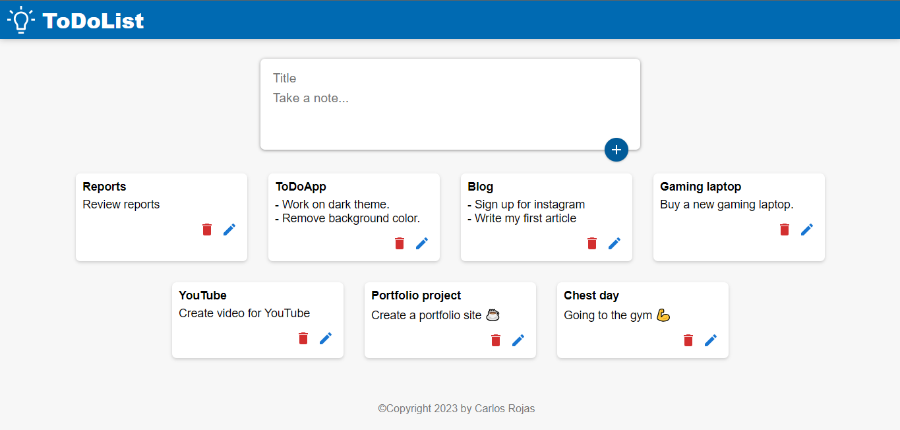

# To-Do App with React + TypeScript

A simple and user-friendly To-Do app built using React. Manage your tasks efficiently and stay organized.

## Table of Contents
- [Demo](#demo)
- [Features](#features)
- [Installation](#installation)

## Demo

You can try the app live at [TodoAppDemo.com](https://www.todoappdemo.com).

## Features

- Add, edit, and delete tasks
- Data persists in local storage
- Mobile-responsive design

# React + TypeScript + Vite

## Getting Started

Follow these steps to set up and run the application on your local machine.

### Prerequisites

Make sure you have Node.js and npm (Node Package Manager) installed. You can download them from [nodejs.org](https://nodejs.org/).

## Installation

1. Clone this repository to your local machine:
2. cd todo-app
3. run npm install
4. npm run dev

